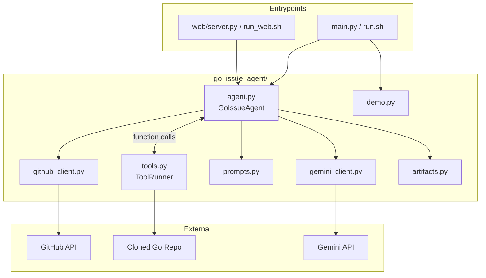

# Go Issue Agent

**Take-home assignment submission** — an agentic AI system that works on GitHub issues from [go-playground/validator](https://github.com/go-playground/validator), explores the repository with tools, applies code fixes, runs Go validation, and produces a pull-request-ready diff and summary.

[](https://www.python.org/)
[](https://aistudio.google.com/)
[](https://github.com/go-playground/validator)

**Repository:** https://github.com/Deepak1465/go-issue-agent

---

## Table of contents

1. [Assignment overview](#assignment-overview)
2. [What this project does](#what-this-project-does)
3. [Quick start (reviewer)](#quick-start-reviewer)
4. [Installation](#installation)
5. [How to run](#how-to-run)
6. [Sample output](#sample-output)
7. [Architecture](#architecture)
8. [Design decisions (why)](#design-decisions-why)
9. [Project structure](#project-structure)
10. [Assignment checklist](#assignment-checklist)
11. [Troubleshooting](#troubleshooting)
12. [Limitations](#limitations)
13. [Further reading](#further-reading)

---

## Assignment overview

### Objective

Build an **agentic AI platform** — not a one-shot prompt wrapper — that can:

| Step | Requirement |
|------|-------------|
| 1 | Take a GitHub issue from an approved Go project |
| 2 | Inspect and understand the repository |
| 3 | Identify relevant files and plan a fix |
| 4 | Modify code following project conventions |
| 5 | Run relevant tests or checks |
| 6 | Generate a PR title and body (opening the PR is optional) |

### Target project

- **Repository:** [go-playground/validator](https://github.com/go-playground/validator)
- **Demo issue:** [#1561 — hostname_rfc1123 does not enforce IPv4 octet check](https://github.com/go-playground/validator/issues/1561)

### What is delivered in this repo

Everything needed to clone, install, run, and review the submission lives in this single repository:

```
go-issue-agent/          ← entire submission package
├── go_issue_agent/      ← agent framework (core)
├── web/ + frontend/     ← optional web UI for demos
├── configs/             ← project-specific rules for validator
├── sample_output/       ← pre-generated run artifacts (issue #1561)
├── run.sh / run_web.sh  ← one-command entry points
└── README.md            ← you are here
```

No external indexes, databases, or paid services are required to review the submission. Demo mode works **without any API key**.

---

## What this project does

Given a GitHub issue URL, the agent runs this pipeline:

```
GitHub issue URL
      │
      ▼
┌─────────────────┐
│ Fetch issue     │  GitHub REST API
└────────┬────────┘
         ▼
┌─────────────────┐
│ Clone repo      │  git clone + branch agent/fix-issue-<N>
└────────┬────────┘
         ▼
┌─────────────────────────────────────────────┐
│ Agent loop (Gemini + tool calling)          │
│  • list_files / search_code / read_file     │
│  • edit_file (exact string replace)         │
│  • run_go (go test, go vet)                 │
│  • submit_pr (title + body)                 │
└────────┬────────────────────────────────────┘
         ▼
┌─────────────────┐
│ Save artifacts  │  report.json, changes.diff, pr_summary.md
└─────────────────┘
```

### Agent tools

| Tool | Purpose | Why it exists |
|------|---------|---------------|
| `list_files` | Browse repo structure | Agent needs orientation before searching |
| `search_code` | Grep `.go` files | Fast symbol/keyword discovery without embeddings |
| `read_file` | Read source code | Required before any edit — prevents hallucinated patches |
| `edit_file` | Exact `old_str` → `new_str` replace | Deterministic, auditable edits (not free-form file writes) |
| `run_go` | Run `go test`, `go vet`, etc. | Validates fixes against the real Go toolchain |
| `submit_pr` | Return PR title and body | Final deliverable; **blocked until tests pass** |

### Example fix (issue #1561)

The sample run fixes a validator bug where `277.168.0.1` was incorrectly accepted as a valid `hostname_rfc1123` value:

1. Agent searched for `isHostnameRFC1123` in `baked_in.go`
2. Added `hasOutOfRangeIPv4Octets` helper to reject invalid octets
3. Added regression tests in `validator_test.go`
4. Ran `go test -run TestHostnameRFC1123 ./...` — passed
5. Generated PR title and body

See [`sample_output/`](sample_output/) for the full trace.

---

## Quick start (reviewer)

**Fastest way to review this submission (no API key, no Go required for the demo):**

```bash
git clone https://github.com/Deepak1465/go-issue-agent.git
cd go-issue-agent
./run.sh --demo
```

This copies pre-generated artifacts from `sample_output/` to `./output/` and prints a summary.

**Interactive web demo (also no API key for sample view):**

```bash
./run_web.sh
# Open http://localhost:8000 → click "View sample output"
```

**Full live agent run (needs Gemini API key + Go installed):**

```bash
cp .env.example .env
# Edit .env → paste GEMINI_API_KEY from https://aistudio.google.com/apikey
./run.sh
```

---

## Installation

### Prerequisites

| Requirement | Version | Used for |
|-------------|---------|----------|
| Python | 3.10+ | Agent runtime |
| pip / venv | — | Dependencies |
| Git | any recent | Clone repos, branches, diffs |
| Go | 1.21+ | `go test` / `go vet` during agent runs |
| Gemini API key | free tier OK | Live LLM calls ([get key](https://aistudio.google.com/apikey)) |

### Step-by-step setup

```bash
# 1. Clone
git clone https://github.com/Deepak1465/go-issue-agent.git
cd go-issue-agent

# 2. Python environment
python3 -m venv .venv
source .venv/bin/activate        # Windows: .venv\Scripts\activate
pip install -r requirements.txt

# 3. API key (skip if using --demo only)
cp .env.example .env
# Open .env and set:  GEMINI_API_KEY=your_key_here

# 4. Clear stale shell exports (if you exported a key before)
unset GEMINI_API_KEY
```

> **Detailed setup with screenshots-style instructions:** see [SETUP.md](SETUP.md)

---

## How to run

### CLI — recommended for scripting

```bash
# Demo mode — no API calls, uses sample_output/
./run.sh --demo

# Live run on default issue (#1561)
./run.sh

# Specific issue URL
./run.sh https://github.com/go-playground/validator/issues/1561

# Custom output directory
./run.sh --demo ./my-output
```

### CLI — advanced options

```bash
python main.py \
  --issue https://github.com/go-playground/validator/issues/1561 \
  --output ./runs/1561 \
  --model gemini-2.5-flash \
  --max-turns 30 \
  --repo-dir /tmp/agent_repos
```

| Flag | Default | Description |
|------|---------|-------------|
| `--issue` | issue #1561 URL | GitHub issue to fix |
| `--output` | `./output` | Where artifacts are written |
| `--demo` | off | Use `sample_output/` — no API key needed |
| `--model` | `gemini-2.5-flash` | Preferred Gemini model |
| `--max-turns` | `30` | Max agent loop iterations |
| `--repo-dir` | `/tmp/agent_repos` | Clone cache directory |

### Web UI — recommended for live demos

```bash
./run_web.sh
```

Open **http://localhost:8000**

- **View sample output** — instant, no API key
- **Run Agent** — paste an issue URL, watch real-time progress (needs `GEMINI_API_KEY` in `.env`)

---

## Sample output

Pre-generated artifacts for issue **#1561** are in [`sample_output/`](sample_output/):

| File | Contents |
|------|----------|
| `report.json` | Issue metadata, full action log, diff stats, PR fields |
| `changes.diff` | `git diff` of the agent's code changes |
| `pr_summary.md` | Human-readable PR title, body, diff, and tool trace |

### Action log excerpt (`report.json`)

The agent took **14 turns** and performed **10 tool calls**:

1. `list_files` — explore repo root
2. `search_code` — find `hostname_rfc1123` references
3. `read_file` — read `baked_in.go`, `regexes.go`, `validator_test.go`
4. `edit_file` — patch validator + tests
5. `run_go` — `go test -run TestHostnameRFC1123 ./...` ✅
6. `run_go` — `go vet ./...` ✅
7. `submit_pr` — PR summary accepted ✅

### Other issues to try

| Issue | Topic | Complexity |
|-------|-------|------------|
| [#1561](https://github.com/go-playground/validator/issues/1561) | Invalid IPv4 octets in hostname validator | Small ✅ (sample included) |
| [#1529](https://github.com/go-playground/validator/issues/1529) | Cron comma-order in ranges | Medium |

---

## Architecture



### Agent loop (ReAct pattern)

Each turn:

1. Send conversation history + system prompt to Gemini
2. Model returns **tool calls** (or final text)
3. Execute tools locally, append results to history
4. Repeat until `submit_pr` succeeds or max turns reached
5. Save `report.json`, `changes.diff`, `pr_summary.md`

### Gemini integration (`gemini_client.py`)

- **Model fallback chain** — tries multiple models with separate free-tier quotas
- **Runtime validation** — queries the API and skips deprecated/unavailable models
- **Rate-limit handling** — exponential backoff, model switching, 60s cooldown retry
- **Default model:** `gemini-2.5-flash`

Supported fallback order:

```
gemini-2.5-flash → gemini-2.0-flash-lite → gemini-2.0-flash
→ gemini-2.5-flash-lite → gemini-flash-latest → gemini-flash-lite-latest
```

---

## Design decisions (why)

### Why tool-calling instead of a single prompt?

The assignment asks for a **system/framework**, not a thin wrapper. Tool-calling gives:

- **Observability** — every step is logged in `report.json`
- **Grounding** — the model reads real files instead of guessing
- **Safety** — edits are exact replacements; tests must pass before PR submission
- **Extensibility** — new tools can be added without rewriting the loop

### Why no RAG / embeddings?

`go-playground/validator` is a medium-sized Go module. `grep` + `read_file` is:

- Faster to set up and debug
- Deterministic (no retrieval misses)
- Sufficient for focused bug fixes

For larger monorepos, embeddings or a repo map could be added as another tool.

### Why exact string-replace edits?

`edit_file(old_str, new_str)` forces the model to copy exact source text. This:

- Reduces risk of malformed patches
- Makes diffs easy to audit
- Matches how many coding agents work in practice

### Why test-gated `submit_pr`?

```python
# tools.py — submit_pr is rejected unless:
# 1. At least one edit was made
# 2. go test has passed at least once
```

This prevents the agent from declaring victory without validation — a common failure mode in autonomous coding agents.

### Why project rules in `configs/`?

`configs/go-playground_validator.md` is injected into the system prompt so the agent knows:

- Where validators live (`baked_in.go`, `regexes.go`)
- How tests are structured
- Which `go test` commands to run

This makes the system **extensible** to other repos: add `configs/{owner}_{repo}.md`.

### Why demo mode?

Free-tier Gemini API keys have low RPM limits. Demo mode (`./run.sh --demo`) lets reviewers evaluate the full output **instantly** without API access or waiting on rate limits.

### Why a web UI?

Useful for interview demos — shows live progress (phases, turns, tool calls) while the agent runs. The CLI produces identical artifacts.

---

## Project structure

```
go-issue-agent/
├── main.py                          # CLI entry point
├── run.sh                           # CLI quick-start (handles venv + .env)
├── run_web.sh                       # Web UI quick-start
├── requirements.txt                 # Python dependencies
├── .env.example                     # API key template (copy to .env)
│
├── go_issue_agent/                  # ★ Core agent framework
│   ├── agent.py                     # Gemini tool-calling loop (GoIssueAgent)
│   ├── tools.py                     # Tool implementations (read, edit, go test)
│   ├── github_client.py             # Issue fetch, git clone/branch/diff
│   ├── gemini_client.py             # API client, model fallback, rate limits
│   ├── prompts.py                   # System prompts + project rules loader
│   ├── artifacts.py                 # Writes report.json, diff, pr_summary.md
│   └── demo.py                      # Demo mode (copies sample_output/)
│
├── web/
│   └── server.py                    # FastAPI backend + job streaming
│
├── frontend/
│   ├── index.html                   # Web UI
│   ├── css/style.css
│   └── js/app.js
│
├── configs/
│   └── go-playground_validator.md   # Repo-specific agent rules
│
├── sample_output/                   # ★ Pre-generated submission artifacts
│   ├── report.json
│   ├── changes.diff
│   └── pr_summary.md
│
├── SETUP.md                         # Step-by-step setup guide
├── INTERVIEW_GUIDE.md               # Interview talking points
├── LICENSE                          # MIT
└── README.md                        # This file
```

---

## Assignment checklist

| Requirement | Status | Evidence |
|-------------|--------|----------|
| Agentic AI system (not one-shot prompt) | ✅ | `go_issue_agent/agent.py` — multi-turn tool loop |
| Works on go-playground/validator | ✅ | `configs/go-playground_validator.md`, prompts |
| Fetches and understands GitHub issues | ✅ | `github_client.py`, `build_initial_prompt()` |
| Inspects repository | ✅ | `list_files`, `search_code`, `read_file` |
| Identifies relevant files | ✅ | Agent reasoning + grep |
| Plans and modifies code | ✅ | `edit_file` with minimal-change prompt |
| Runs tests/checks | ✅ | `run_go` tool |
| Generates PR title and body | ✅ | `submit_pr` tool + `pr_summary.md` |
| README with setup instructions | ✅ | This file + `SETUP.md` |
| Sample outputs / artifacts | ✅ | `sample_output/` |
| Easy to run locally | ✅ | `./run.sh --demo`, `./run_web.sh` |
| Extensible framework | ✅ | Tools, configs, prompts are modular |

---

## Troubleshooting

| Problem | Solution |
|---------|----------|
| `No GEMINI_API_KEY in .env` | Copy `.env.example` → `.env`, paste your key |
| Old/wrong key still used | Run `unset GEMINI_API_KEY` then `./run.sh` |
| `429 RESOURCE_EXHAUSTED` | Free-tier rate limit — wait ~1 min, or use `./run.sh --demo` |
| `404 NOT_FOUND` on model | Fixed — runtime model list skips deprecated models |
| `go not found` | Install Go from https://go.dev/dl/ |
| Agent slow on free tier | Normal — model fallback waits on rate limits |
| Daily quota exhausted | Wait 24h, use new Google account key, or `--demo` |

### Run without any API key

```bash
./run.sh --demo
# or: ./run_web.sh → "View sample output"
```

---

## Limitations

- **Single project focus** — optimized for `go-playground/validator`; extensible via `configs/`
- **Does not open GitHub PRs** — produces local branch, diff, and PR summary
- **Best for small/medium bugs** — not large refactors or architectural changes
- **Requires Go on PATH** for live validation (demo mode does not)
- **Free-tier Gemini limits** — live runs may be slow; demo mode is instant
- **String-replace edits** — fragile if the model copies whitespace incorrectly (mitigated by read-before-edit prompt)

---

## Further reading

| Document | Purpose |
|----------|---------|
| [SETUP.md](SETUP.md) | Detailed install and first-run guide |
| [INTERVIEW_GUIDE.md](INTERVIEW_GUIDE.md) | Elevator pitch, architecture Q&A, demo script |
| [sample_output/report.json](sample_output/report.json) | Full agent action trace |
| [configs/go-playground_validator.md](configs/go-playground_validator.md) | Project-specific rules |

---

## License

MIT — see [LICENSE](LICENSE).

---

**Author:** Deepak Yadav  
**Submission repo:** https://github.com/Deepak1465/go-issue-agent
